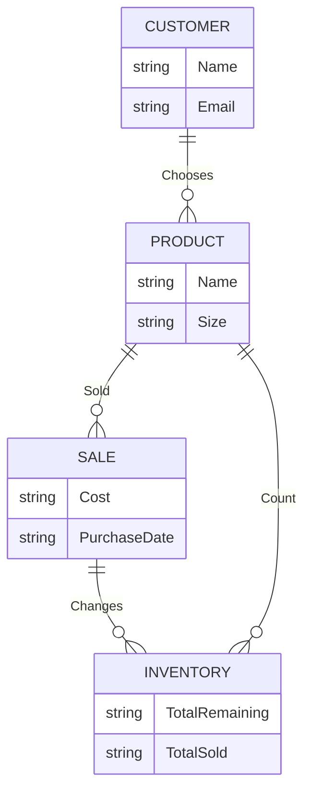

The *product* would be the item for purchase. In this case Nike shoes.

The *customer* is anyone in the market for Nike shoes.

*Sales* rely on customers purchasing said product.

*Inventory* counts are affected by sales and the lack of sold items.

Product, inventory, and sales all rely on customers. The customer chooses a product and the purchase affects inventory and profits. 
